# Xpedition Advanced Capability Toolkit

Xpedition Advanced Capability Toolkit (XACT) is a modular utility library and a suite of automation tools for schematic and PCB design in Xpedition. It provides solutions for common tasks, significantly reducing development time. XACTly what you need to simplify your development!

## Setup

>[!WARNING]
>XACT was not tested with Siemens modern UI

To use the toolkit, you must do the following:

- In `scripts.ini`, the paths:

  ``` text
  [ViewDraw]
  script#0=*root directory*\Scripts\DxD_menu_builder.js

  [Expedition PCB - Document]
  Script#0=*root directory*\Scripts\faReporter.js
  Script#1=*root directory*\Scripts\PCBscriptsMenu.js
  ```

- In all files, perform a global replace of
  `var libsRoot = "\\edm\\WDIR_Corporate\";` with
  `var libsRoot = *root directory*;`


## Core libraries

The `Core` folder contains the following libraries:

- `csv_lib` – parsing CSV files
- `fa_parser_lib` – parsing the FA report from Layout
- `filesystem_lib` – working with the file system
- `json_lib` – working with JSON
- `linq_lib` – working with collections (similar to LINQ in .NET)
- `mg_utils` – some frequently used calls to the internal API
- `output_lib` – library for outputting messages to the Designer/Layout window, to a file, or to the console
- `string_lib` – working with strings

## Xpedition Designer toolbar

The Xpedition Designer toolbar contains following scripts:

1. **Open DxD folder** and **Open PCB folder** – Buttons that open the schematic or PCB project folder. The PCB folder will be opened if the project is local. If it's an EDM development, the PCB folder won't open (an error message will appear).

2. **Add Cluster** – This utility assigns the Cluster property to all schematic components based on their hierarchical path in the schematic project. This property is used to pass grouping information to the layout.

3. **Net Assigner** – This utility allows automatic pin assignment of components when a CSV file containing pin numbers and net names is available.

   For example, STM32CubeMX exports a microcontroller pinout in the following format:

   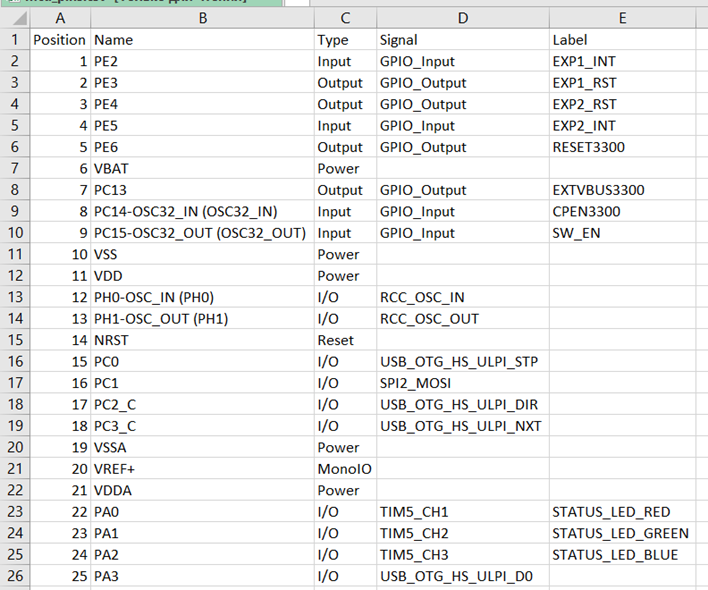

   For such a file, the settings will look like this:

   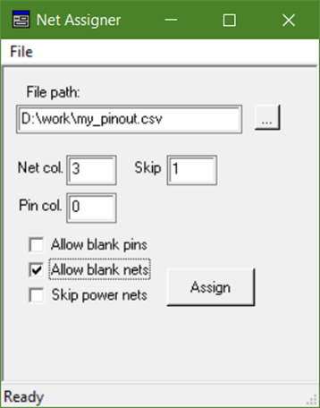

>[!IMPORTANT]
>Column numbering starts from 0, not 1.

   Skip field is used if there is a header/title that needs to be skipped
   Allow blank pins/nets allows skipping rows if they don't contain a pin number or net name (like in the example above).

   Skip power pins skips pins with names matching the following rules:

   - An optional + or – at the beginning
   - One or more digits
   - A separator (. , V , p)
   - Optional fractional digits
   - Examples: +1V2, -2.5, 1p8

>[!IMPORTANT]
>To make the script work, you need to select a single symbol on which the nets will be placed.

   After clicking the Assign button, nets from column D will appear on the corresponding pins of the component. To use custom net names, change the net column index from 3 to 4 and run Assign again. The corresponding nets from column E will be renamed.

   Below are step‑by‑step changes on the schematic: before, first iteration (column D), second iteration (column E).

   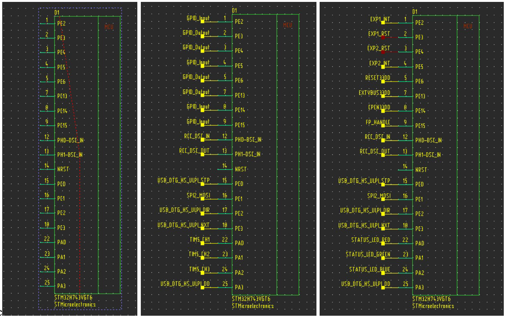

4. **Connector Namer** – This utility allows you to quickly place net names connected to connector pins in the connector symbol fields. Select a connector component (must have a reference designator starting with X…), then click the toolbar button. As a result, the text corresponding to the net names on the connector pins appears on the schematic:

   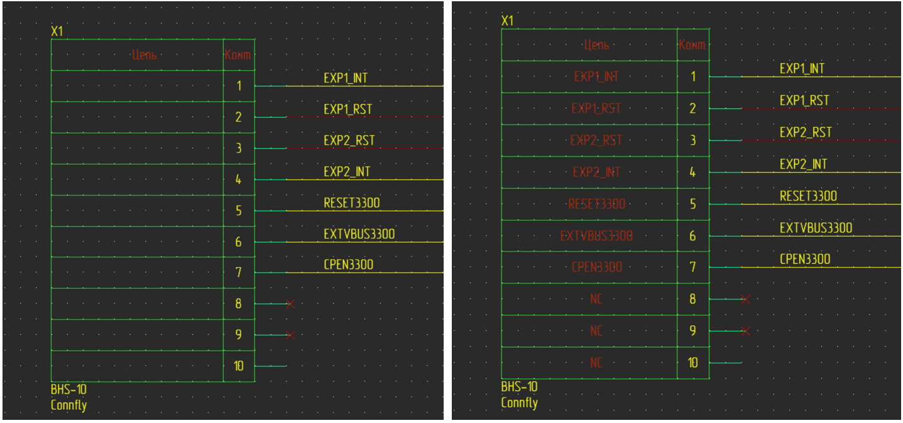

>[!IMPORTANT]
>This text is just plain text and it is not part of the connector symbol and is not linked to the nets connected to the connector.

5. **Label Aligner** – This utility aligns the net labels of power and ground symbols (symbols of type Link). To use it, select a symbol and click on the button in the toolbar. For all symbols with the same symbol name, the net labels on the current sheet will be aligned as shown in the image below.

   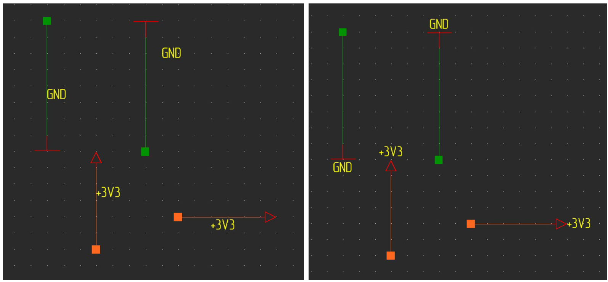

>[!IMPORTANT]
>The utility looks for the net name on the segment connected to the symbol. If the net name is attached to another segment, duplication may occur. Carefully check your schematics.
>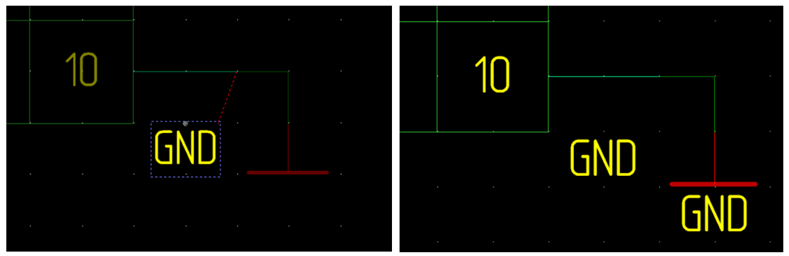

6. **Add version** – This utility reads the current version of the schematic project from EDM and adds it to the first sheet of the schematic.

   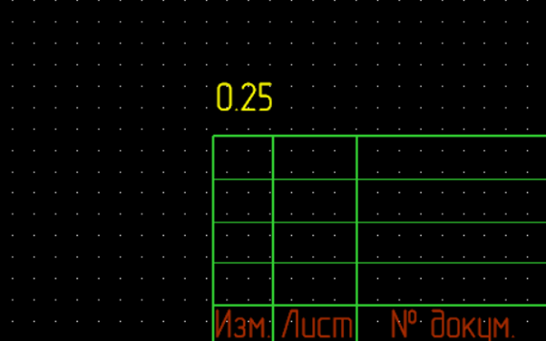

>[!IMPORTANT]
>The added version is valid in the BOM and on the schematic ONLY if a Check‑In is performed!

>[!IMPORTANT]
>For this script to work without modifying the source code, the border must have a name like `.*list1_gost` and contain a `doc_Version` field. You could change it by replacing corresponding text in script.

7. **Check schematic** – This tool performs a number of schematic checks, specifically:

   - All components have footprints (requires a serialized library file `*.szDb`)
   - Non‑Automatic fonts are not used
   - There are no resistors/capacitors/inductors with the same value and package but different part numbers (checks properties PartNumber, Value, PackageName)
   - There are no Obsolete components in the schematic (checks components having the property Obsolete)
   - There are no global signals in the schematic

   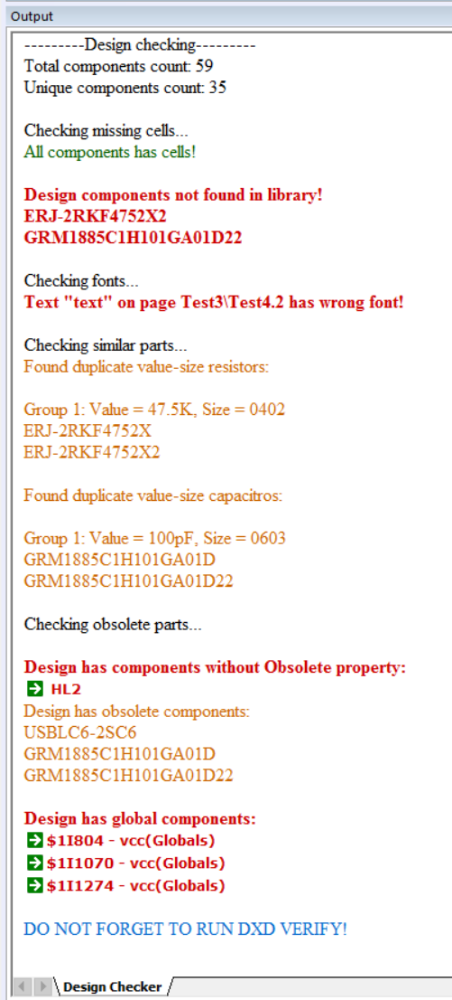

   Each check can be disabled by changing the corresponding check flag to false at the beginning of the script:

   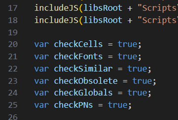

>[!IMPORTANT]
>The scope of checks in this utility is limited, so it is recommended to run the standard Verify of the schematic editor after it.

8. **Calcs** – This button opens a web‑based calculator in the browser, containing some calculations that may be useful during schematic development:

   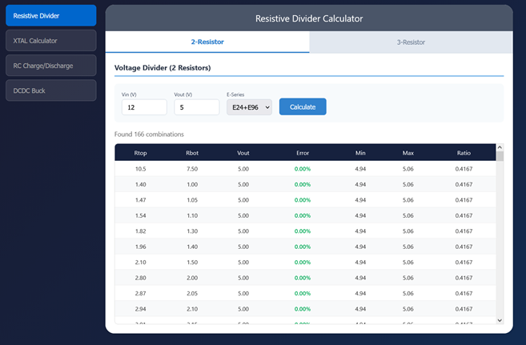

## Xpedition Layout toolbar

The Xpedition Layout toolbar contains two scripts:

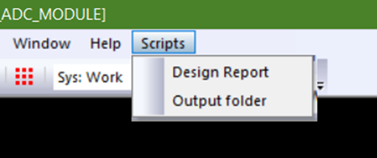

1. **Design Report** – The script outputs general board information, hazard statistics, information about used vias, and checks the actual minimum trace width and via diameters.

   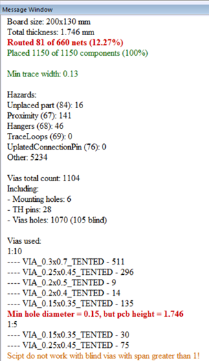

2. **Output folder** – Simply opens the folder containing manufacturing output data.

## PCB Forward Annotation

In addition, during a Forward Annotation, the script `faReporter.js` is triggered, which parses the `ForwardAnnotation.txt` report and displays errors and warnings in a clear manner (in the current version of the script, for user convenience, only warnings about missing footprints in the library are shown).
